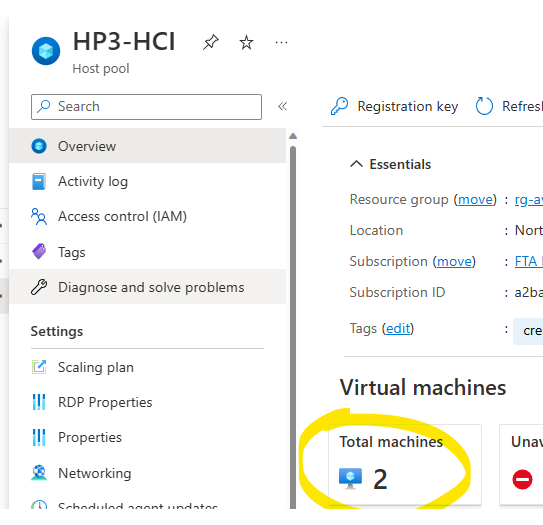
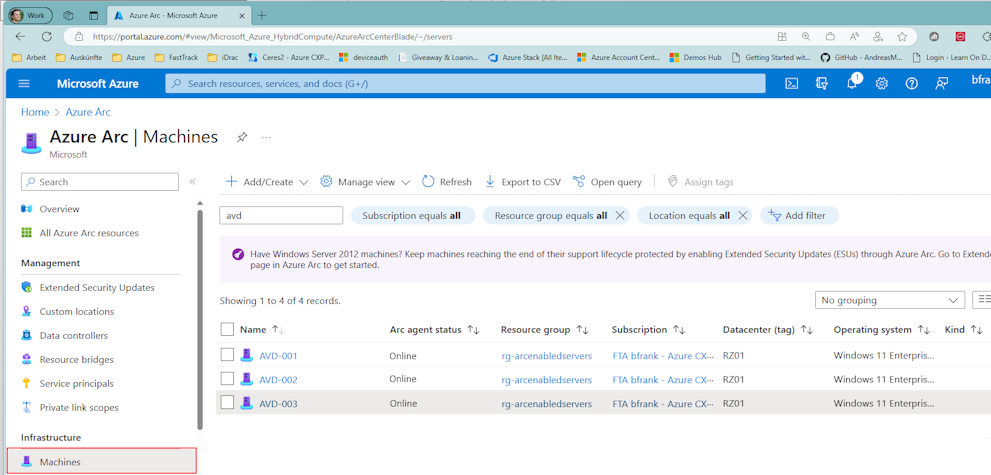

# How To Deploy AVD On AzStack HCI

> Warning: Scripts are samples - no warranties - Use at your own risk!!!  
> Note: The caveat to the manual process is that your VMs are 'bybassing' and hence not known to the Azure Resource Bridge - hence cannot be managed by it - hence you will e.g. not be able to start and stop these VMs from the Azure Portal. That might be ok for learning, test and demo purposes but it is **not** the [intended](../intendedway/readme.md) usage.  
 
## Watch it done on YT: [Azure Stack HCI - Hybrid Series - Azure Virtual Desktop (AVD)](https://www.youtube.com/watch?v=pXI576Idx-c&list=PLDk1IPeq9PPeVwlvJZgo4n8Mw9Qj5gW0L)  


## Manually
See: [Set up Azure Virtual Desktop for Azure Stack HCI (preview) - manual](https://learn.microsoft.com/en-us/azure/virtual-desktop/azure-stack-hci?tabs=manual-setup)

0. You require: A registered HCI cluster, AD sync'ed with AAD, a valid Azure subscription
1. Download the VDI image from the Azure marketplace you want to use.
2. (optional) Optimize image e.g. convert to dynamically expanding vhdx to save disk space.
3. (optional - but likely) Create a VM for golden image creation: E.g. to run windows update, install your language packs, applications, frameworks, runtimes -> sysprep (!!!important!!! using: mode:vm) -> Checkpoint for later re-use.
   > Note: Only install what will 'survive' a sysprep (e.g. don't do ARC Agent nor AVD Hostpool registration yet) 
4. (optional) FSLogix: Prepare a SMB file share (provide profile share with correct ACLs)
5. (optional) FSLogix: Prepare a GPO for the AD OrgUnit (OU) the VDIs will be joined to.
6. Deploy a empty AVD Hostpool in Azure.
7. Create a Application Group for this Hostpool and allow an AAD User Group access to it.
8. Create a Workspace containing the App Group created before.
9. Deploy a VDI VM on HCI using the VDI image (from vhdx obtained in 1./2. or 3.)
10. Deploy the AVD Agents into the VDI VM
11. Arc-enable your AVD session hosts. Why?!...
12. Deploy the Remote Desktop App for the User
13. (optional) when you are using proxies for the session hosts.
14. (optional) Publish NotepadPlusPlus in your AVD Application Group
15. Enable [Azure verification for VMs](https://learn.microsoft.com/en-us/azure-stack/hci/deploy/azure-verification?tabs=wac) for **activation** of your AVD session host OS 

## 1. Download the VDI image from the Azure marketplace you want to use
Do this on an admin box 
```Powershell
#Make sure you have the Azure modules required

$modules = @("Az.Accounts","Az.Resources","Az.Compute")
    
foreach ($module in $modules) {
    if (!(Get-Module -Name $module -ListAvailable)) {
        Install-Module -Name $module -Force -Verbose
    }
}

#login to Azure
Login-AzAccount -Environment AzureCloud #-Tenant blabla.onmicrosoft.com  -UseDeviceAuthentication
   
#hit the right subscription
Get-AzSubscription | Out-GridView -Title "Select the right subscription" -OutputMode Single | Select-AzSubscription

#we need the context info later
$azureContext = Get-AzContext 

#select a location near you
$location = Get-AzLocation | Out-GridView -Title "Select your location (e.g. westeurope)" -OutputMode Single

#region select an Azure AVD Image (e.g. Windows 11) and create an Azure disk of it for later download (to onprem)
    #get the AVDs group published images by selecting 'microsoftwindowsdesktop'
    $imPub = Get-AzVMImagePublisher -Location $($location.Location) | Out-GridView -Title "Select image publisher (e.g. 'microsoftwindowsdesktop')" -OutputMode Single

    #select the AVD Desktop OS of interest e.g. 'windows-11'
    $PublisherOffer = Get-AzVMImageOffer -Location $($location.Location) -PublisherName $($imPub.PublisherName) |  Out-GridView -Title "Select your offer (e.g. windows-11)" -OutputMode Single

    # select the AVD version e.g. 'win11-21h2-avd'
    $VMImageSKU = (Get-AzVMImageSku -Location $($location.Location) -PublisherName $($imPub.PublisherName) -Offer $PublisherOffer.Offer).Skus | Out-GridView -Title "Select your imagesku (e.g. win11-22h2-avd)" -OutputMode Single

    #select latest version
    $VMImage = Get-AzVMImage -Location $($location.Location) -PublisherName $PublisherOffer.PublisherName -Offer $PublisherOffer.Offer -Skus $VMImageSKU | Out-GridView -Title "Select your version (highest build number)" -OutputMode Single

    #Create a VHDX (Gen2) from this image
    $imageOSDiskRef = @{Id = $vmImage.Id}
    $diskRG = Get-AzResourceGroup | Out-GridView -Title "Select The Target Resource Group" -OutputMode Single
    $diskName = "disk-" + $vmImage.Skus
    $newdisk = New-AzDisk -ResourceGroupName $diskRG.ResourceGroupName -DiskName "$diskName" -Disk $(New-AzDiskConfig -ImageReference $imageOSDiskRef -Location $location.Location -CreateOption FromImage -HyperVGeneration V2 -OsType Windows )

    Write-Host "You should now have a new disk named $($newdisk.name) in your resourcegroup" -ForegroundColor Green  
#endregion
```
Next is to download the Azure disk to one of your HCI nodes:  
```PowerShell
#region Create a temp. download link and download the disk as virtual disk (.vhd)
    $AccessSAS =  $newdisk | Grant-AzDiskAccess -DurationInSecond ([System.TimeSpan]::Parse("05:00:00").TotalSeconds) -Access 'Read'
    Write-Host "Generating a temporary download access token for $($newdisk.Name)" -ForegroundColor Green 
    $DiskURI = $AccessSAS.AccessSAS

    $folder = "\\...OneHCINodeHere....\c$\temp"   #enter one of the nodes here - the path must be accessible by the user - beware that there is enough space (127GB) for the disk to be downloaded.

    $diskDestination = "$folder\$($newdisk.Name).vhd"
    Write-Host "Your disk will be placed into: $diskDestination" -ForegroundColor Green
    #"Start-BitsTransfer ""$DiskURI"" ""$diskDestination"" -Priority High -RetryInterval 60 -Verbose -TransferType Download"

    #or use azcopy as it is much faster!!!
    invoke-webrequest -uri "https://aka.ms/downloadazcopy-v10-windows" -OutFile "$env:TEMP\azcopy.zip" -verbose
    Expand-Archive "$env:TEMP\azcopy.zip" "$env:TEMP" -force -verbose
    copy-item "$env:TEMP\azcopy_windows_amd64_*\\azcopy.exe\\" -Destination "$env:TEMP" -verbose
    cd "$env:TEMP\"
    &.\azcopy.exe copy $DiskURI $diskDestination --log-level INFO
    Remove-Item "azcopy*" -Recurse  #cleanup temp
#endregion
```
## 2. (optional) Optimize image e.g. convert to dynamically expanding vhdx to save disk space.  
**Do this on system with Hyper-V installed, e.g. on a cluster node.**  

```PowerShell
#region Convert to a dynamic vhdx!
    $finalfolder = "C:\clusterstorage\CSV\Images"        # pls enter an existing final destination to hold the AVD image.
    $diskFinalDestination = "$finalfolder\Win11-multi-opt.vhdx"
    $sourceDiskPath = "c:\temp\disk-win11-22h2-avd.vhd"

    Convert-VHD -Path "$sourceDiskPath" -DestinationPath "$diskFinalDestination" -VHDType Dynamic

    try
    {
        $beforeMount = (Get-Volume).DriveLetter -split ' '
        Mount-VHD -Path $diskFinalDestination
        $afterMount = (Get-Volume).DriveLetter -split ' '
        $driveLetter = $([string](Compare-Object $beforeMount $afterMount -PassThru )).Trim()
        Write-Host "Optimizing disk ($($driveLetter)): $diskFinalDestination" -ForegroundColor Green
        &defrag "$($driveLetter):" /o /u /v
    }
    finally
    {
        Write-Host "dismounting ..."
        Dismount-VHD -Path $diskFinalDestination
    }
      
    Optimize-VHD $diskFinalDestination -Mode full
#endregion
```

## 3. (optional) Create a VM for golden image creation 
You probably want update or use your apps in the VDIs. So you before creating desktops from the image you e.g. might want to ...:
- ...do a windows update run first...
- ...install your language packs...
- ...install SW deployment agents, applications, frameworks, runtimes...
...onto the image - before you finalize it with a sysprep.   

Yes?! -> 
1. Create a VM on HCI using the vhdx file you have just dowloaded|optimized.  
2. Then perform the actions you want as described above.  
3. (optional - recommended) Shutdown the VM in HCI - do a checkpoint - so that you can return to this state later. Boot up again.
4. Then sysprep the vm to get a generalized version you can create VDI clones from.
```
c:\Windows\System32\Sysprep\sysprep.exe /oobe /generalize /shutdown /mode:vm
```
> Important to us the **mode:vm** switch (it'll tell the vm that the virtualization platform (HCI) has not changed)otherwise you might experience long boot times.
5. Export the vm's .vhdx to your HCI cluster's image folder (some place on a CSV)

## 4. (optional) FSLogix: Prepare a SMB file share (provide profile share with correct ACLs)  

>Note: There is another YT series: [Azure Stack HCI - Workload Series - Scale-Out File Server (SOFS) For Highly Available - SMB Shares](https://www.youtube.com/watch?v=Rv7BcNUpy_U&list=PLDk1IPeq9PPeWG5m7yjh7ojwJMxalbXTa) that might be useful for hosting AVD profiles.

Here is a script sample that would set the required NTFS permissions for a folder to be used for FSLogix profiles.  
Make sure the domain, path and AD group name are correct for your system.

```PowerShell
$DomainName = "myavd"   #pls enter your domain name.

#1st remove all exiting permissions.
$acl = Get-Acl "\\Sofs\fslogix1"    # change to your path!!!

$acl.Access | % { $acl.RemoveAccessRule($_) }
$acl.SetAccessRuleProtection($true, $false)
$acl | Set-Acl
#add full control for 'the usual suspects'
$users = @("$DomainName\Domain Admins", "System", "Administrators", "Creator Owner" )
foreach ($user in $users) {
    $new = $user, "FullControl", "ContainerInherit,ObjectInherit", "None", "Allow"
    $accessRule = new-object System.Security.AccessControl.FileSystemAccessRule $new
    $acl.AddAccessRule($accessRule)
    $acl | Set-Acl 
}

# make sure you have an 'AVD Users' group !!!
# this will add read & write on parent folder ->required for FSLogix - no inheritence 
$allowWVD = "AVD Users", "ReadData, AppendData, ExecuteFile, ReadAttributes, Synchronize", "None", "None", "Allow"
$accessRule = new-object System.Security.AccessControl.FileSystemAccessRule $allowWVD
$acl.AddAccessRule($accessRule)
$acl | Set-Acl 
```  

## 5. (optional) FSLogix: Prepare a GPO for the AD OrgUnit (OU) the VDIs will be joined to.  
This is a script sample to create a group policy object suitable for FSLogix profiles in AD. Make sure the variables (e.g. OU) and paths match yours.

```PowerShell
$OUSuffix = "OU=AVDHosts,OU=HCI"  #the part after the "...,DC=powerkurs,DC=local" so e.g. "OU=HostPool1,OU=AVD"


#this will be our temp folder - need it for download / logging
$tmpDir = "c:\temp\" 

#create folder if it doesn't exist
if (!(Test-Path $tmpDir)) { mkdir $tmpDir -force }

#downloading FSLogix.
Write-Output "downloading fslogix"

$tempPath = "$tmpDir\FSLogix"
$destinationPath = "$tmpDir\FSLogix.zip"
if (!(Test-Path $destinationPath)) {
    "downloading fslogix"
    Invoke-WebRequest -Uri "https://aka.ms/fslogix_download" -OutFile $destinationPath -verbose
    Expand-Archive $destinationPath -DestinationPath $tempPath -Force -verbose
}

$fqdn = (Get-WmiObject Win32_ComputerSystem).Domain
$policyDestination = "Microsoft.PowerShell.Core\FileSystem::\\$fqdn\SYSVOL\$fqdn\policies\PolicyDefinitions\"

mkdir $policyDestination -Force
mkdir "$policyDestination\en-us" -Force
Copy-Item "Microsoft.PowerShell.Core\FileSystem::$tempPath\*" -filter "*.admx" -Destination "Microsoft.PowerShell.Core\FileSystem::\\$fqdn\SYSVOL\$fqdn\policies\PolicyDefinitions" -Force -Verbose
Copy-Item "Microsoft.PowerShell.Core\FileSystem::$tempPath\*" -filter "*.adml" -Destination "Microsoft.PowerShell.Core\FileSystem::\\$fqdn\SYSVOL\$fqdn\policies\PolicyDefinitions\en-us" -Force -Verbose


$gpoName = "FSLogixDefExcl{0}" -f [datetime]::Now.ToString('dd-MM-yy_HHmmss') 
New-GPO -Name $gpoName 
$FSLogixRegKeys = @{
    Enabled = 
    @{
        Type  = "DWord"
        Value = 1           #set to 1 to enable.
    }
    VHDLocations = 
    @{
        Type  = "String"
        Value = "\\SOFS\Profile1;\\SOFS\Profile2"
    }
    DeleteLocalProfileWhenVHDShouldApply =
    @{
        Type  = "DWord"
        Value = 1
    }
    VolumeType = 
    @{
        Type  = "String"
        Value = "VHDX"
    }
    SizeInMBs = 
    @{
        Type  = "DWord"
        Value = 30000
    }
    IsDynamic = 
    @{
        Type  = "DWord"
        Value = 1
    }
    PreventLoginWithFailure = 
    @{
        Type  = "DWord"
        Value = 0
    }
    LockedRetryInterval = 
    @{
        Type  = "DWord"
        Value = 10
    }
    LockedRetryCount = 
    @{
        Type  = "DWord"
        Value = 5
    }
    FlipFlopProfileDirectoryName = 
    @{
        Type = "DWord"
        Value = 1
    }
}

foreach ($item in $FSLogixRegKeys.GetEnumerator()) {
    "{0}:{1}:{2}" -f $item.Name, $item.Value.Type, $item.Value.Value
    Set-GPRegistryValue -Name $gpoName -Key "HKEY_LOCAL_MACHINE\SOFTWARE\fslogix\profiles" -ValueName $($item.Name) -Value $($item.Value.Value) -Type $($item.Value.Type)
}

#enable path exclusions in windows defender for fslogix profiles
Set-GPRegistryValue -Name $gpoName -Key "HKEY_LOCAL_MACHINE\Software\Policies\Microsoft\Windows Defender\Exclusions" -ValueName "Exclusions_Paths" -Value 1 -Type DWord

$excludeList = @"
%ProgramFiles%\FSLogix\Apps\frxdrv.sys,
%ProgramFiles%\FSLogix\Apps\frxdrvvt.sys,
%ProgramFiles%\FSLogix\Apps\frxccd.sys,
%TEMP%\*.VHD,
%TEMP%\*.VHDX,
%Windir%\TEMP\*.VHD,
%Windir%\TEMP\*.VHDX,
\\SOFS\Profile1\*\*.VHD,
\\SOFS\Profile1\*\*.VHDX,
\\SOFS\Profile2\*\*.VHD,
\\SOFS\Profile2\*\*.VHDX
"@
foreach ($item in $($excludeList -split ',')) {
    $item.Trim()
    Set-GPRegistryValue -Name $gpoName -Key "HKEY_LOCAL_MACHINE\Software\Policies\Microsoft\Windows Defender\Exclusions\Paths"  -ValueName "$($item.Trim())" -Value 0 -Type String 
}

Import-Module ActiveDirectory
$DomainPath = $((Get-ADDomain).DistinguishedName) # e.g."DC=contoso,DC=azure"

$OUPath = $($($OUSuffix + "," + $DomainPath).Split(',').trim() | where { $_ -ne "" }) -join ','
Write-Output "creating FSLOGIX GPO to OU: $OUPath"

$existingGPOs = (Get-GPInheritance -Target $OUPath).GpoLinks | Where-Object DisplayName -Like "FSLogixDefExcl*"

if ($existingGPOs -ne $null) {
    Write-Output "removing conflicting GPOs"
    $existingGPOs | Remove-GPLink -Verbose
}


New-GPLink -Name $gpoName -Target $OUPath -LinkEnabled Yes -verbose

#cleanup existing but unlinked fslogix GPOs
$existingGPOs | % { [xml]$Report = Get-GPO -guid $_.GpoId | Get-GPOReport -ReportType XML; if (!($Report.GPO.LinksTo)) { Remove-GPO -Guid $_.GpoId -Verbose } }


```  

## 10. Deploy the AVD Agents into the VDI VM
Execute this PS script inside a VDI VM to make it part of a Hostpool. 
>Note: Your VDI VM needs to be domain joined before + must have outbound internet access (it will download stuff and register). You also need to provide a valid %RegistrationToken%

```PowerShell
#region AVD agent download (do this in the VM)
    #https://docs.microsoft.com/en-us/azure/virtual-desktop/create-host-pools-powershell?tabs=azure-powershell#register-the-virtual-machines-to-the-azure-virtual-desktop-host-pool

    #this will be our temp folder - need it for download / logging
    $tmpDir = "c:\temp\" 
    
    #create folder if it doesn't exist
    if (!(Test-Path $tmpDir)) { mkdir $tmpDir -force }
    
    $agentURIs = @{
    'agent.msi' = "https://query.prod.cms.rt.microsoft.com/cms/api/am/binary/RWrmXv"
    'bootloader.msi' = "https://query.prod.cms.rt.microsoft.com/cms/api/am/binary/RWrxrH"}
    
    foreach ($uri in $agentURIs.GetEnumerator())
    {
            Write-Output "starting download...."
            Invoke-WebRequest "$($uri.value)" -OutFile "$tmpDir\$($uri.key)"
    }

    $RegistrationToken = "eyJhbGciOiJ...." # a valid hostpool registration token [Azure portal] -> Azure Virtual Desktop -> Host Pool -> %Your Hostpool%  -> Registration token
    #unattended install
    start-process -filepath msiexec -ArgumentList "/i ""$tmpDir\agent.msi"" /l*v ""$tmpDir\agent.msi.log"" REGISTRATIONTOKEN=$RegistrationToken /passive /qn /quiet /norestart " -Wait
    start-process -filepath msiexec -ArgumentList "/i ""$tmpDir\bootloader.msi"" /l*v ""$tmpDir\bootloader.msi.log""  /quiet /qn /norestart /passive" -Wait

#endregion
```
After some minutes they should show up in the AVD hostpool:  


## 11. Arc-enable Your AVD Session Hosts
Technically it is installing another agent (aka ***Azure connected machine agent***) into each desktop and connect it to Azure. Your desktop will show up in your Azure subscription.  
  

**1. Why Should You Do This?:**  
Your AVDs may work without this but it is a best practice as:  
- ...it is also **required for Health checks** 
- ...it is the starting point for Azure-backed monitoring, protection, configuration,... -operations
  - e.g. You can run VM extensions and attach additional Azure services like Azure Policy, defender for cloud etc. to the VMs.
  - see what you can do...[Supported cloud operations](https://learn.microsoft.com/en-us/azure/azure-arc/servers/overview#supported-cloud-operations)  

**2. How Can You Do This?**  
There are a couple of [onboarding methods](https://learn.microsoft.com/en-us/azure/azure-arc/servers/deployment-options#onboarding-methods) available.  
In a **mass** (unattended,scripted) **deployment** you **probably create an Azure service principal** (an identity for apps with specific rights **in your Azure subscription** that works even if MFA is required) and **then** **run PowerShell inside each desktop** - e.g. like:    
```PowerShell
#### adjust the variables !!! ####
$ServicePrincipalId = "8b42....7eee"
$ServicePrincipalClientSecret ="GyG...KUI"
$subScriptionId = "a2ba24....57e6f"
$tenantId = "47f4......f65aab0"
$resourceGroup = "rg-AVD-HPool1-WE"
$location = "westeurope"
$tags = "Datacenter=DC0815,City=SomeTown,StateOrDistrict=SomeDistrict,CountryOrRegion=SomeCountry,Purpose=AVD"


try {
    $env:AUTH_TYPE = "principal";
    $env:CLOUD = "AzureCloud";
    # downloading the azure connected machine agent
    [Net.ServicePointManager]::SecurityProtocol = [Net.ServicePointManager]::SecurityProtocol -bor 3072;
    Invoke-WebRequest -UseBasicParsing -Uri "https://aka.ms/azcmagent-windows" -TimeoutSec 30 -OutFile "$env:TEMP\install_windows_azcmagent.ps1";
    & "$env:TEMP\install_windows_azcmagent.ps1";        #installing
    if ($LASTEXITCODE -ne 0) { exit 1; }
    & "$env:ProgramW6432\AzureConnectedMachineAgent\azcmagent.exe" connect --service-principal-id "$ServicePrincipalId" --service-principal-secret "$ServicePrincipalClientSecret" --resource-group "$resourceGroup" --tenant-id "$tenantId" --location "$location" --subscription-id "$subScriptionId" --cloud "$env:CLOUD" --tags $tags ; #connecting to azure
}
catch {
    #report error in case something fails
    $logBody = @{subscriptionId="$subScriptionId";resourceGroup="$resourceGroup";tenantId="$tenantId";location="$location";authType="$env:AUTH_TYPE";operation="onboarding";messageType=$_.FullyQualifiedErrorId;message="$_";};
    Invoke-WebRequest -UseBasicParsing -Uri "https://gbl.his.arc.azure.com/log" -Method "PUT" -Body ($logBody | ConvertTo-Json) | out-null;
    Write-Host  -ForegroundColor red $_.Exception;
}
```

## 13. adding proxy...
in order to make the RDagent and RD bootagent use proxies - you may need to run this in the session host:  
```
bitsadmin /util /setieproxy LOCALSYSTEM Manual_Proxy proxy1:8080 null
bitsadmin /util /setieproxy NETWORKSERVICE Manual_Proxy proxy1:8080 null
```
Whereas proxy1:8080 is to be replaced with your proxy and port.


## 14. Publish NotepadPlusPlus in your AVD Application Group  
When using the wizard in the Azure Portal notepad++ might produce an error:  
`"message": "The resource you are looking for has been removed, had its name changed, or is temporarily unavailable."`  
However with a slight name change and using an ARM template you can add NotepadPlusPlus to your AVD App Group.  
[](https://portal.azure.com/#create/Microsoft.Template/uri/https%3A%2F%2Fraw.githubusercontent.com%2FbfrankMS%2FAzStackHCI%2Fmain%2FAVD%2FNotePadPlusPlus.json)