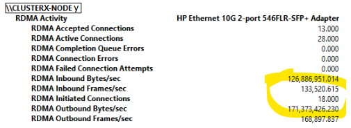

# How To Do Test-RDMA
 
>Note: Before putting workload to your cluster make sure RDMA has been properly configured. Sometimes settings seem correct but no RDMA traffic is observed. This test can help.

## Why should I do this? "Rule of Thumb..."
...if you see a lot of packets in taskmanager on your SMB (RDMA enabled) adapters -> get suspicious - because when properly configured you should not see those. (You should observe them using RDMA counters in perfmon)

## How to do the test
1. Download [Test-Rdma.ps1](https://github.com/microsoft/SDN/blob/master/Diagnostics/Test-Rdma.ps1)
2. Download [diskspd](https://aka.ms/getdiskspd) onto your node e.g. with:  
```PowerShell
mkdir c:\temp
start-bitstransfer "https://aka.ms/getdiskspd" "c:\temp\diskspd.zip" -Priority High -RetryInterval 60 -Verbose
Expand-Archive c:\temp\diskspd.zip c:\temp\diskspd
# Code for diskspd is here https://github.com/Microsoft/diskspd
```
3. RDP into the node using a domain account with admin rights on all nodes.
- open powershell  
- navigate to c:\temp
- Do a `Get-NetAdapter` to get all the Nics ifIndex e.g.  
```
PS C:\temp> get-netadapter

Name                      InterfaceDescription                    ifIndex Status       MacAddress             LinkSpeed
----                      --------------------                    ------- ------       ----------             ---------
pNIC02                    Mellanox ConnectX-3 Ethernet Adapter #2      17 Up           00-02-C9-3B-9A-81        10 Gbps
Ethernet                  Remote NDIS Compatible Device                14 Up           78-45-C4-F3-62-99     426.0 Mbps
vEthernet (vMGMT)         Hyper-V Virtual Ethernet Adapter             12 Up           00-15-5D-B1-A8-00        10 Gbps
vEthernet (SMB1)          Hyper-V Virtual Ethernet Adapter #2          10 Up           00-15-5D-B1-A8-01        10 Gbps
NIC4                      QLogic BCM57800 Gigabit Ethernet (ND...       9 Disconnected 90-B1-1C-29-59-FA          0 bps
vEthernet (SMB2)          Hyper-V Virtual Ethernet Adapter #3           8 Up           00-15-5D-B1-A8-02        10 Gbps
pNIC01                    Mellanox ConnectX-3 Ethernet Adapter          7 Up           00-02-C9-3B-9A-80        10 Gbps
NIC3                      QLogic BCM57800 Gigabit Ethernet (...#2       5 Disconnected 90-B1-1C-29-59-F8          0 bps
NIC2                      QLogic BCM57800 10 Gigabit Etherne...#2       4 Disconnected 90-B1-1C-29-59-F6          0 bps
NIC1                      QLogic BCM57800 10 Gigabit Ethernet ...       2 Disconnected 90-B1-1C-29-59-F4          0 bps
```
4. Take the 1st storage adpater you want to test -> e.g. SMB1 -> interface index = 10 
- Launch test rdma like e.g.:  
```PowerShell
.\Test-RDMA.ps1 -IfIndex 10 -IsRoCE $true -RemoteIpAddress 192.168.10.184 -PathToDiskspd "c:\temp\diskspd\amd64"
```
Where remote IP address is the remote adapter's ip that can be reached via the local SMB1 adapter.  
(you can ping first if you are uncertain)
  
The output should be something like:
```
VERBOSE: Diskspd.exe found at c:\temp\DiskSpd\amd64\diskspd.exe
VERBOSE: The adapter  vEthernet (SMB1)  is a  vNIC
VERBOSE: Retrieving vSwitch bound to the virtual adapter
VERBOSE: Found vSwitch: S2DSwitch
VERBOSE: Found the following physical adapter(s) bound to vSwitch: pNIC02, pNIC01
VERBOSE: Underlying adapter is RoCE. Checking if QoS/DCB/PFC is configured on each physical adapter(s)
VERBOSE: QoS/DCB/PFC configuration is correct.
VERBOSE: RDMA configuration is correct.
VERBOSE: Remote IP 192.168.10.184 is reachable.
VERBOSE: Disabling RDMA on adapters that are not part of this test. RDMA will be enabled on them later.
VERBOSE: Testing RDMA traffic. Traffic will be sent in a background job. Job details:
VERBOSE: 700599348 RDMA bytes written per second
VERBOSE: 26466825 RDMA bytes sent per second
VERBOSE: 711326594 RDMA bytes written per second
VERBOSE: 26459854 RDMA bytes sent per second
VERBOSE: 718014566 RDMA bytes written per second
VERBOSE: 26408155 RDMA bytes sent per second
VERBOSE: 713305774 RDMA bytes written per second
...
VERBOSE: 26384721 RDMA bytes sent per second
VERBOSE: 713992318 RDMA bytes written per second
VERBOSE: 26796631 RDMA bytes sent per second
VERBOSE: 428838206 RDMA bytes written per second
VERBOSE: 0 RDMA bytes sent per second
VERBOSE: Enabling RDMA on adapters that are not part of this test. RDMA was disabled on them prior to sending RDMA traffic.
SUCCESS: RDMA traffic test SUCCESSFUL: RDMA traffic was sent to 192.168.10.184
```  
Keyword is **SUCCESSFUL** ;-)

**Whilst doing this you might want to look at the perfmon counters for RDMA of the node.**:  
On your admin box: start **perfmon** -> Server: *your node*  -> add counter category 'RDMA Activity' -> choose e.g.  
"RDMA Inbound Bytes/sec", "RDMA Outbound Bytes/sec",...  


5. Repeat the tests for other RDMA adapters